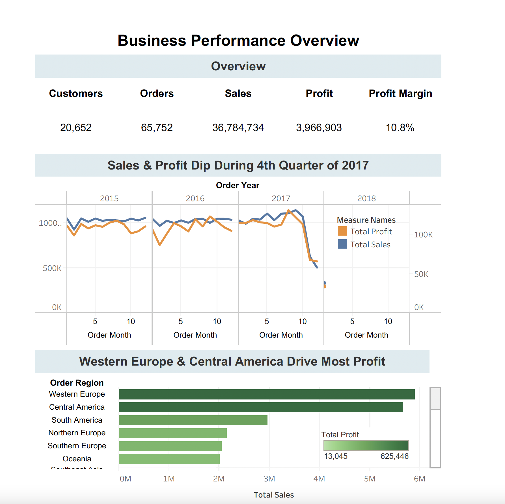

# Retail Sales & Delivery Performance Analysis
SQL & Tableau project analyzing sales, profitability, and shipping efficiency across 180K+ orders.

## Overview
This project analyzes retail sales, profitability, customer behavior, and delivery performance using SQL and Tableau.  
The objective is to identify revenue drivers, operational inefficiencies, and trade-offs between shipping speed and reliability.

---

## Dataset
The dataset contains approximately **180,000 order-level records** including:
- Sales and profit metrics
- Customer and regional information
- Product and category details
- Shipping modes and delivery status
- Order and shipping dates

---

## Tools & Technologies
- **Python** - Data cleaning
- **MySQL** – Data storage, cleaning, and KPI creation  
- **SQL** – Aggregations, analytical queries, and business metrics  
- **Tableau Public** – Interactive dashboards and data visualization  

---

## Key Business Questions
- How are sales and profit trending over time?
- Which regions contribute most to revenue and profitability?
- Are high sales volumes translating into high profit?
- How reliable are different shipping modes?
- Does faster shipping improve delivery performance?

---

## KPIs & Analysis
### Business Performance
- Total Sales
- Total Profit
- Profit Margin
- Number of Orders
- Number of Customers
- Sales & Profit Trends
- Regional Sales and Profit

### Delivery & Shipping Performance
- Average Actual vs Scheduled Shipping Days
- On-Time vs Late Delivery Rate
- Orders by Shipping Mode
- Revenue Contribution by Shipping Mode

### Customer & Product Performance Analysis
- Customer Segment Sales & Profit
- Highest Selling Categories & Average Discounts
- Most Profitable Categories
- High Volume Customers

---

## Key Insights
- The business generated **$36.8M in total sales** with an overall **profit margin of 10.8%**.
- Sales and profit experienced a notable decline during **Q4 2017**, indicating potential seasonal or operational risk.
- **Western Europe and Central America** are the strongest contributors to overall profit.
- Actual shipping exceeds scheduled delivery by **0.57 days on average**, suggesting consistent delays.
- **Standard Class shipping** accounts for approximately **61% of total revenue** and is more reliable than faster shipping options.

---

## Dashboards
The analysis is presented through interactive Tableau dashboards:
1. **Business Performance Overview** – Sales, profit, and regional performance
2. **Delivery & Shipping Performance** – Shipping reliability and operational efficiency
3. **Customer & Product Performance Analysis** - Customer profitability and hottest items being sold

🔗 *Tableau Public Link:*  
(https://public.tableau.com/views/Supplychainvisuals/Dashboard1?:language=en-US&:sid=&:redirect=auth&:display_count=n&:origin=viz_share_link)

---

## Repository Structure
retail-sales-shipping-analysis/
│
├── assets/           
├── python/           
├── report/           
├── sql/             
├── tableau/         
└── README.md

---

## Dashboard Preview

### Business Performance Overview

### Delivery & Shipping Performance

## Customer & Product Performance Analysis

## Deliverables
- Python code of the data cleaning process → [python/](python/)
- SQL-based KPI views and analysis queries → [sql/](sql/)
- Three interactive Tableau dashboards → [tableau/](tableau/)
- Written project report → [report/](report/)
- Documented insights connecting business and operational performance → [assets/](assets/)

